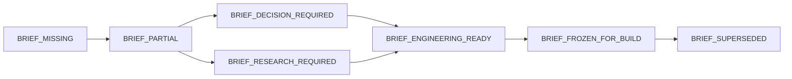

# DFG Development Brief Standard — DDB v1

**Version:** 1.0.0  
**Status:** CANONICAL REPOSITORY SPECIFICATION  
**Scope:** DFG Universe (Lucius, Alfred, Darwin, Billy, Trading, Client Engagements)

---

## 1. Purpose & Guiding Principles

The **DFG Development Brief Standard (DDB v1)** normalizes how internal and external software and product initiatives enter Lucius Engineering. It ensures that every development task has sufficient product, business, authority, and technical definition before code mutation begins.

### Key Rules
- **No Unresolved Critical Decisions at Build Time:** If material product decisions (e.g. pricing, scope, legal approvals) remain unmade, engineering is blocked.
- **Do Not Re-Brief Active Developments:** Existing mature projects (`lucius-engineering`, `billy-production-engine`, `darwin-research-engine`) are NOT rebriefed from scratch. They receive `NEXT_CAPABILITY_DDB`, `FEATURE_DDB`, or `SUBPHASE_DDB` packets.
- **Tiers Match Complexity:** `DDB-LITE` avoids bureaucratic overhead for internal maintenance; `DDB-STANDARD` governs new features/adapters; `DDB-FULL` governs major multi-system pipelines and client contracts.

---

## 2. DDB Core Dimensions

Every Development Brief addresses the following dimensions:

1. **IDENTITY:** Project ID, Feature ID, version, owner engine, internal vs external client, priority, tier.
2. **PROBLEM:** Root problem being solved and who experiences it.
3. **OUTCOME:** Desired measurable end-state or operational unlock.
4. **USERS & ACTORS:** Primary operators, system callers, explicit non-users.
5. **USE CASES:** Real-world workflows and interaction sequences.
6. **SCOPE:**
   - `IN`: Explicitly included deliverables.
   - `OUT`: Explicit non-goals.
   - `LATER`: Deferred milestones.
7. **FUNCTIONAL REQUIREMENTS:** Explicit technical and behavioral capabilities.
8. **UX / INTERFACE:** CLI flags, TUI screens, API endpoints, or Web UI mockups.
9. **INPUTS & OUTPUTS:** Data schemas, file paths, formats, error states.
10. **DATA:** Persistence mechanism, retention, ownership, sensitivity.
11. **INTEGRATIONS:** Local tools, database engines, remote providers.
12. **BUSINESS RULES:** Deterministic logic, rate limits, thresholds, timeouts.
13. **AUTOMATION & AUTHORITY:** Required authority class (`CLASS A`–`CLASS D`), unattended eligibility, forbidden operations.
14. **SECURITY / PRIVACY / COMPLIANCE:** Secrets handling, credentials, compliance boundaries.
15. **ECONOMICS:** Operational budget, provider API costs, monetization role, TTFD (Time to First Dollar). Missing numbers remain strictly `UNKNOWN`.
16. **NON-FUNCTIONAL REQUIREMENTS:** Latency bounds, failure recovery, memory/disk budgets.
17. **EXISTING ASSETS:** Reusable code, models, fixtures, documentation.
18. **ARCHITECTURE CONSTRAINTS:** Isolated worktree requirements, schema isolation, no external network leaks.
19. **MVP DEFINITION:** Minimal viable slice for initial deployment or test acceptance.
20. **ACCEPTANCE CRITERIA:** Testable conditions required to declare success.
21. **TESTING HARNESS:** Targeted unit, binding, regression, and integration suites.
22. **DEPLOYMENT / OPERATION:** Runtime launch command, process lifecycle, monitoring.
23. **DOCUMENTATION:** Canonical markdown deliverables to update in repo.
24. **OPEN QUESTIONS:** Catalog of pending items with assigned owners.
25. **DEPENDENCIES & BLOCKERS:** Prerequisite tasks, baseline SHAs, external dependencies.
26. **ROADMAP:** Progression from MVP to V1 to Later.
27. **LUCIUS HANDOFF AUTHORITY:** Explicit sign-off required to freeze brief for implementation.

---

## 3. Decision Ownership Taxonomy

Every open question or blocker must be assigned to an explicit decision owner:

| Decision Owner | Permitted Decisions | Strict Invariants & Prohibitions |
| :--- | :--- | :--- |
| **`OPERATOR_DECISION_REQUIRED`** | Business strategy, capital allocation, partner selection, equipment values. | Lucius and Darwin must never fabricate operator decisions. |
| **`CLIENT_DECISION_REQUIRED`** | Commercial scope, client approval, branding, API credentials. | Must be confirmed by external client before build freeze. |
| **`DARWIN_RESEARCH_REQUIRED`** | Feasibility benchmarks, market size analysis, technology scouting. | Darwin produces research evidence; never commits operator capital. |
| **`ANDY_FINANCIAL_REVIEW_REQUIRED`** | Expense thresholds, fee modeling, bookkeeping structure. | Andy oversees accounting; does not define product behavior. |
| **`LEGAL_COMPLIANCE_REVIEW_REQUIRED`** | Jurisdictional clearance, copyright, terms of service. | Blocks automated execution until clearance is logged. |
| **`LUCIUS_ARCHITECTURE_DECISION`** | Data structures, ORM schemas, test harness design, modular decoupling. | Lucius decides technical architecture within authorized scope. |
| **`ENGINEERING_DISCOVERY_REQUIRED`** | Prototype spikes, API response profiling, latency measurement. | Strictly bounded discovery without permanent side effects. |

---

## 4. Engineering Readiness Gate

The `DevelopmentBriefValidator` evaluates briefs against the following lifecycle states:

### Readiness Requirements for `BRIEF_ENGINEERING_READY`:
1. Problem statement and measurable outcome are defined.
2. In-scope deliverables and functional requirements are explicit.
3. Acceptance criteria are testable via deterministic assertions.
4. Authority classification is unambiguous.
5. All critical unresolved questions (`is_critical_for_build == True`) are resolved (`count == 0`).
